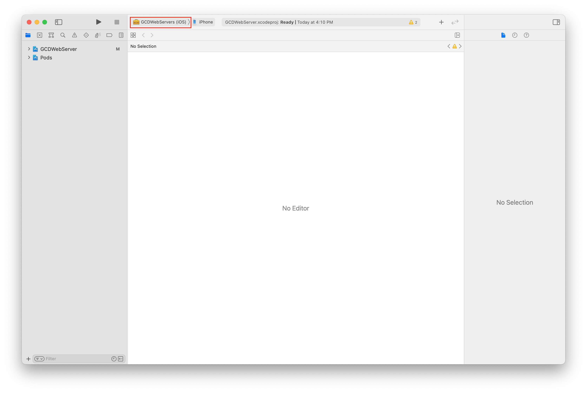
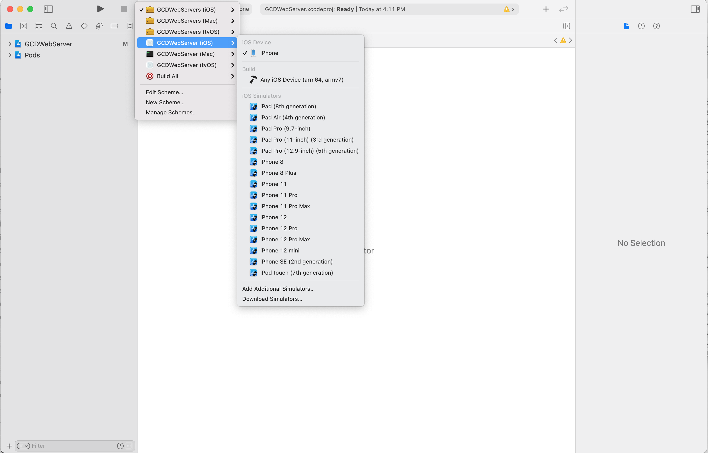
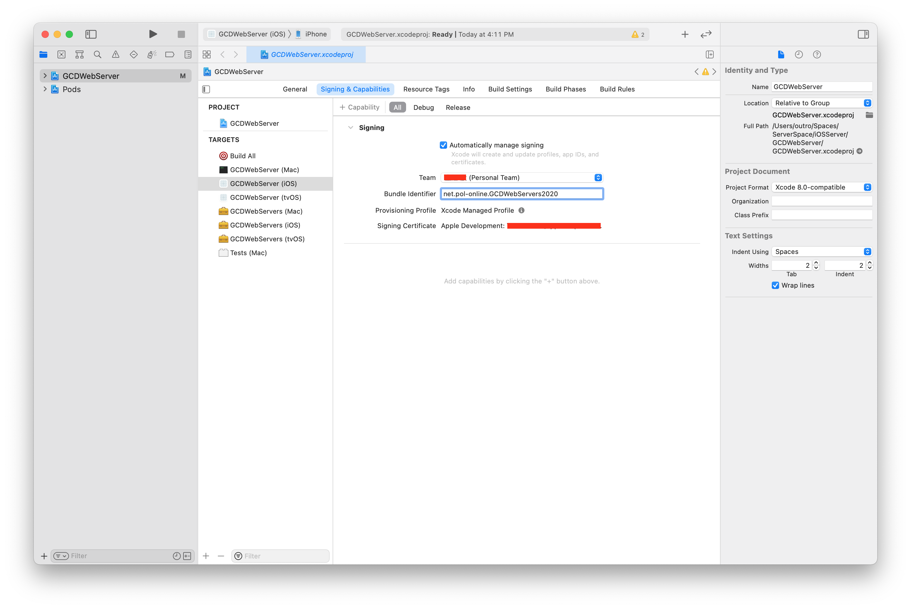
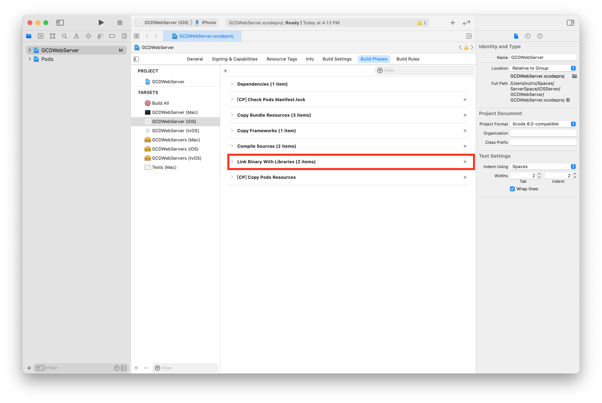
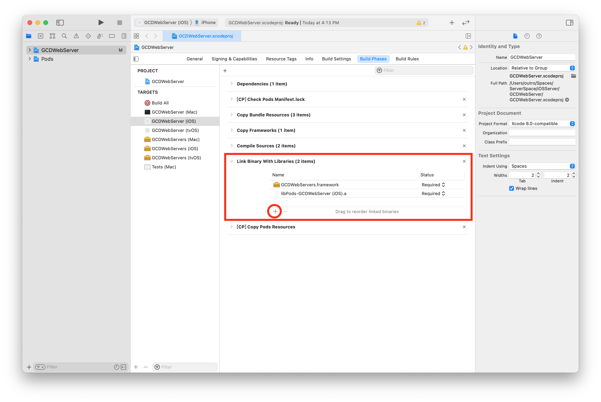
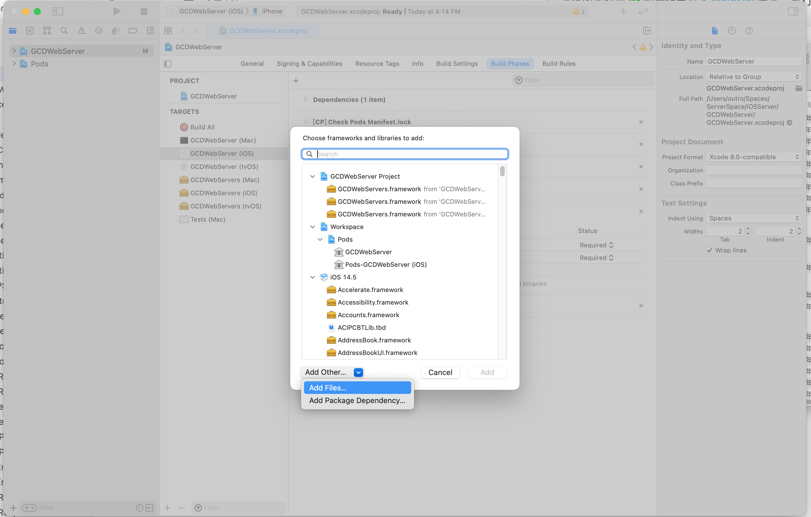
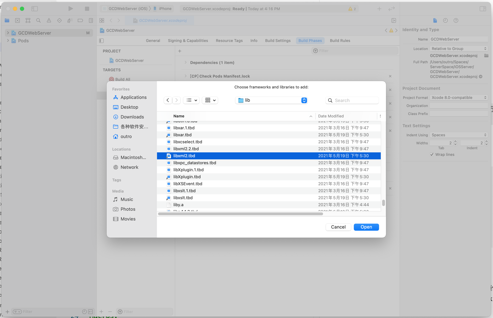
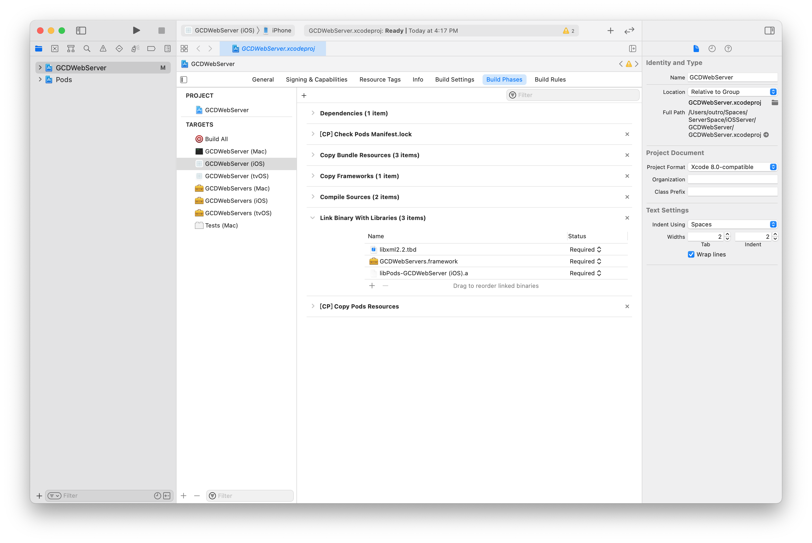
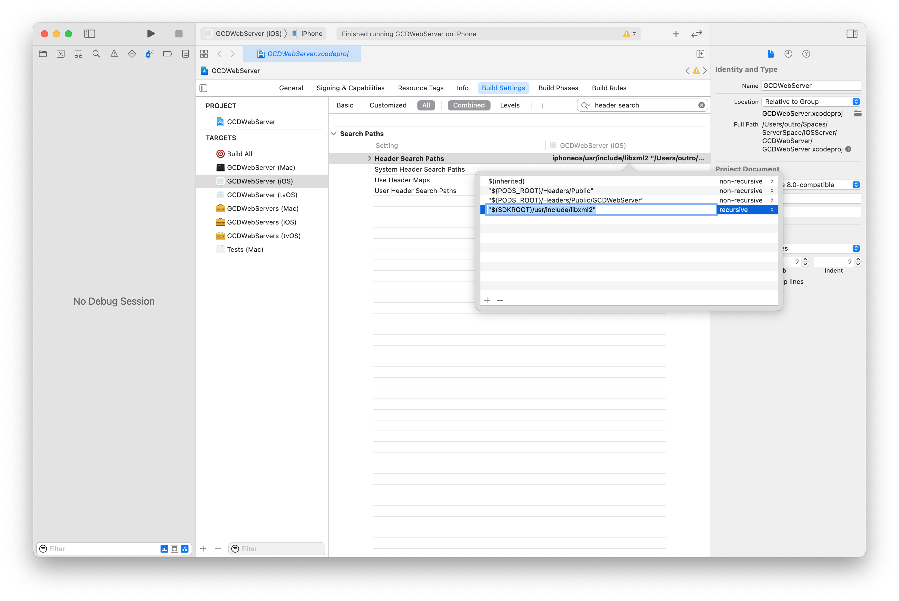

# 说明

使用 GCDWebServer 将废弃 iOS 设备作为服务器使用

# 食用须知

1. 一个苹果账号
2. macOS 系统
3. 已安装 cocoapods

# 食用方法

> 下述内容标记 ✅ 的操作已写入 setup.sh 脚本，执行 setup.sh 即可生效配置

参考 [Getting Start](https://github.com/swisspol/GCDWebServer#getting-started)，步骤如下：

- 创建 Podfile，并写入 pod 依赖项：✅

```Podfile
# 版本号可变，视自己手头设备来定
platform :ios, '13.0'

workspace './GCDWebServer.xcodeproj'

target 'GCDWebServer (iOS)' do
  pod "GCDWebServer", "~> 3.0"
  pod "GCDWebServer/WebUploader", "~> 3.0"
  pod "GCDWebServer/WebDAV", "~> 3.0"
end
```

根目录执行 `pod install`

- xcode 引入 libz.tbd 和 libxml2 头文件目录
  自行配置时请先找到 xcode sdk 目录（vscode 随便创建一个 c/cpp 文件，include stdio.h/cstdio 点击跳转就能找到 sdk 路径，或者 xcode 查看 \$(SDKROOT) 对应路径），pod install 之后打开 `GCDWebServer.xcodeproj.xcworkspace` 具体步骤如下：
  
  
  
  
  
  
  
  
  
  最后一步的路径为 `$(SDKROOT)/usr/include/libxml2`

运行成功后终端搜索本机 ip 地址可看到端口号，iOS 默认端口号为 80
